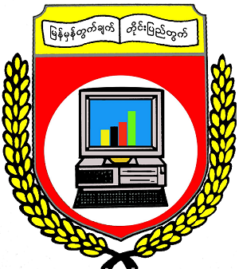
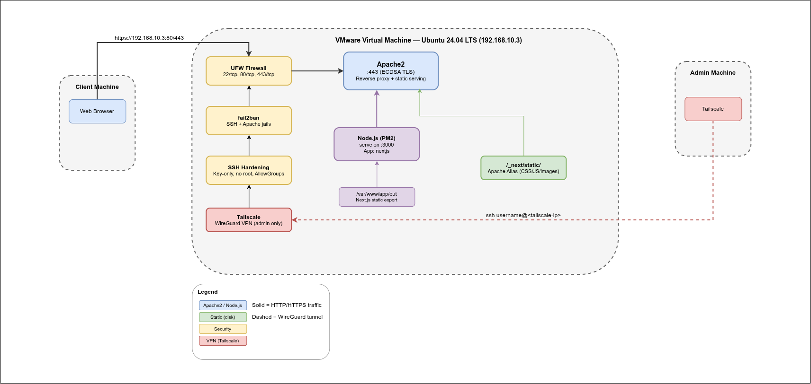

<style scoped>
section {
  display: flex;
  flex-direction: column;
  justify-content: center;
  align-items: center;
  text-align: center;
}
</style>



### **University of Computer Studies, Yangon**

#### Faculty of Computer Systems and Technologies
##### Linux Fundamentals (CST-311)
###### Project Presentation

---

<style scoped>
section {
  display: flex;
  flex-direction: column;
  justify-content: center;
  align-items: center;
  text-align: center;
}
</style>
## A Modern Secure Web Server
###### Presented by Group 7

---

<style scoped>
section {
  display: flex;
  flex-direction: column;
  justify-content: center;
  align-items: center;
  text-align: center;
}
</style>
| No. | Name | YKPT |
| --- | --- | --- |
| 1 | Maung Khant | YKPT - 22988 |
| 2 | Aung Myint Myat Aung | YKPT - 23029 |
| 3 | Gon Yaung Win | YKPT - 23013 |
| 4 | Aung Khant Kyaw | YKPT - 23023 |
| 5 | San Thiri Tun | YKPT - 23078 |
| 6 | Kaung Htut Thaw | YKPT - 23020 |
| 7 | Han Linn Htun | YKPT - 23005 |
| 8 | Shoon Lae Aung | YKPT - 23026 |
| 9 | Aung Myint Myat | YKPT - 23046 |

---

## Objectives
* Project Overview
* Tech Stack & Tools
* Architecture & Design
* Network Topology
* Users & Groups
* File Permissions
* SSH Hardening
* Firewall Rules (UFW)
* Intrusion Prevention (fail2ban)
* Boot Sequence
* Conclusion & Future Work
* References

---

## Project Overview
###### A secure Apache2 web server hosting a self-paced course website

The project applies lecture concepts in a real-world scenario:

* User & group management — dedicated sysadmin (sudo) and dev (deployment) accounts instead of a shared root workflow
* File permissions — least-privilege ownership of /var/www/app, web server cannot modify its own document root
* Service hardening — key-only SSH, UFW firewall, fail2ban, hidden server version

---

## Tech Stack & Tools
* **Operating System**: Ubuntu 24.04 LTS
* **Web Server**: Apache2
* **Application**: Node.js and Tailwind CSS 3
* **Process Management**: PM2 (Process Manager 2)
* **Version Control**: Git & GitHub
* **Security**: UFW, fail2ban, key-only SSH, Tailscale (admin tunnel)

---

## Architecture & Design



---

## Architecture & Design (contd.)

Administrative access is restricted to the host machine via Tailscale (WireGuard VPN). The deployment workflow is as follows:
```bash
Host machine
    │
    │  Tailscale (WireGuard tunnel)
    ▼
VM Tailscale interface
    │
    │  ssh <user>@<tailscale-ip>
    ▼
SSH (22)  ── key-only auth, password disabled
    │
    │  agmyintmyat (primary deployer with sudo privileges)
    ▼
git pull → npm install → npm run build → pm2 restart
```

---

## Architecture & Design (contd.)

Client traffic is served over HTTPS (443) with TLS termination at Apache2. The static site is generated by Next.js and served by `serve` on port 3000, managed by PM2 for auto-restart and log management.
```bash
Client (browser)
    │
    │  https://192.168.10.3
    ▼
Apache2 (:443)  ── TLS termination (self-signed ECDSA cert)
    │
    ├── /_next/static/*  ── Alias ──▶ /var/www/app/out/_next/static/ (disk)
    │
    ├── /health  ── Alias ──▶ /var/www/app/out/health.json (disk)
    │
    └── /*  ── ProxyPass ──▶ PM2 → serve (:3000)
```

---

## Network Topology
```bash
┌──────────────┐      ┌───────────────────────┐      ┌──────────────┐
│ Client       │      │   VMware NAT Network  │      │ Host Machine │
│ (browser)    │      │   192.168.10.0/24     │      │ (admin)      │
│              │      │                 ◄────────────────────────── │
│  ──────────────────────────────────────▶    │      │  Tailscale   │
│  https://192.168.10.3:443                   │      │  ─ WireGuard │
└──────────────┘      │                       │      └──────────────┘
                      │  Gateway: 192.168.10.2│
                      │  VM IP:   192.168.10.3 (static, Netplan)
                      │  DNS:     8.8.8.8, 8.8.4.4
                      └───────────────────────┘
```
---

## Users & Groups

```
Group: sysadmin (sudo ALL)
├── mgkhant
├── agmyintmyatag
├── gonyaungwin
├── agkhantkyaw
└── santhiritun

Group: dev (deployment only)
├── kghtutthaw
├── hanlinhtun
├── shoonlaeaung
└── agmyintmyat ← primary deployer
```

---

## File Permissions
<style scoped>
  table {
    width: 100% !important;
    font-size: 25px !important;
    border-collapse: collapse;
  }

  th, td {
    padding: 6px 8px !important;
    white-space: nowrap;
  }

  td:first-child code {
    white-space: normal !important;
    word-break: break-all !important;
  }

  code {
    font-size: 20px !important;
    padding: 2px 4px !important;
  }
</style>
| Path | Owner | Group | Dir perms | File perms | Purpose |
| --- | --- | --- | --- | --- | --- |
| `/var/www/app/` | `agmyintmyat` | `dev` | 775 | 664 | Web app root |
| `/etc/ssl/private/selfsigned.key` | `root` | `root` | — | 600 | TLS private key |
| `/etc/ssl/certs/selfsigned.crt` | `root` | `root` | — | 644 | TLS certificate |
| `/etc/ssh/sshd_config` | `root` | `root` | — | 644 | SSH config overrides |
| `/etc/fail2ban/jail.local` | `root` | `root` | — | 644 | Fail2ban config |
| `/etc/apache2/sites-available/app.conf` | `root` | `root` | — | 644 | Apache vhost |

---

## SSH Hardening

| Setting | Value | File |
| --- | --- | --- |
| `PasswordAuthentication` | `no` | `/etc/ssh/sshd_config` |
| `PermitRootLogin` | `no` | `/etc/ssh/sshd_config` |
| `AllowGroups` | `sysadmin dev` | `/etc/ssh/sshd_config` |
| Authentication | Key-based only | SSH key pair on host |

---

## Firewall Rules (UFW)

| Port | Protocol | Action | Purpose |
| --- | --- | --- | --- |
| 22 | TCP | ALLOW | SSH access |
| 80 | TCP | ALLOW | HTTP (redirects to HTTPS) |
| 443 | TCP | ALLOW | HTTPS |
| All others | — | DENY | Blocked by default |

###### Allow outgoing connections, deny incoming connections.

---

## Intrusion Prevention (fail2ban)

| Jail | Max retries | Ban time | Log watched |
| --- | --- | --- | --- |
| `sshd` | 3 | 1 Day | `/var/log/auth.log` |
| `apache-auth` | 3 | 1 Day | `/var/log/apache2/app-error.log` |

---

## Boot Sequence

On VM startup, the following services start automatically:

```
1. systemd
   ├── sshd (OpenSSH server)
   ├── apache2 (web server + reverse proxy)
   ├── pm2-agmyintmyat.service (PM2 daemon, runs as agmyintmyat)
   │   └── restores saved process list → serve /var/www/app/out → port 3000
   ├── ufw (firewall)
   ├── fail2ban (intrusion prevention)
   └── tailscale (admin tunnel, if configured)

2. Apache is ready → client can reach :80 and :443
3. PM2 restores processes → port 3000 listening
4. Full chain operational: HTTPS :443 → ProxyPass → :3000
```

---

## Conclusion & Future Work
* Successfully deployed a secure, self-hosted web server with a static course website
* Future improvements:
  * Run on a cloud VM for better availability and scalability
  * Use a valid TLS certificate (e.g., Let's Encrypt) for production
  * Implement domain name and DNS configuration for public access

---

## References
- [Ubuntu Server Guide](https://ubuntu.com/server/docs)
- [Apache2 Documentation](https://httpd.apache.org/docs/2.4/)
- [Apache mod_proxy Documentation](https://httpd.apache.org/docs/2.4/mod/mod_proxy.html)
- [Next.js Deployment Guide](https://nextjs.org/docs/deploying)
- [Ubuntu UFW Guide](https://help.ubuntu.com/community/UFW)
- [Fail2ban Documentation](https://github.com/fail2ban/fail2ban)
- [Tailscale Documentation](https://tailscale.com/kb/)
- [PM2 Documentation](https://pm2.keymetrics.io/docs/usage/quick-start/)
- [Netplan Documentation](https://netplan.io/)
- [Linux File Permissions Guide](https://www.linuxfoundation.org/blog/linux-file-permissions)

---

## Clone?

To get a copy of our project, please visit [our GitHub repository](https://github.com/ammdevl/linux-sysadmin-web-server-project) or clone it directly using:

```bash
git clone https://github.com/ammdevl/linux-sysadmin-web-server-project.git

cd linux-sysadmin-web-server-project/

## Now follow the README.md for instructions.

```


---

<style scoped>
section {
  display: flex;
  flex-direction: column;
  justify-content: center;
  align-items: center;
  text-align: center;
}
</style>


## Thank You for Your Attention.

###### Any Questions?